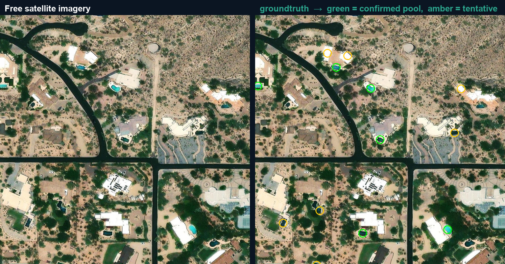

# revalign-overhead

[](https://github.com/RevAlign/revalign-overhead/actions/workflows/ci.yml)
[](./LICENSE)
[](https://www.python.org/)
[](https://colab.research.google.com/github/RevAlign/revalign-overhead/blob/main/notebooks/demo.ipynb)

**The data you need is sitting in satellite images, and nobody can export it.**

You can see it with your own eyes on a map: every backyard pool, every rooftop solar array, every grain silo, every center-pivot irrigation circle. But "see it" is not "have it." There is no download button, no CSV, no lat/lon. The information is locked inside pixels.

`revalign-overhead` unlocks it. Give it a point, a radius, and a description of what to look for. It pulls free satellite tiles, stitches them, runs detection, deduplicates across tile boundaries, optionally confirms with a color gate, and hands you a spreadsheet: one row per object, with latitude, longitude, a confidence score, and a Google Maps link you can click to eyeball each hit. It also saves an annotated proof image so you can trust the list before you use it.

<p align="center">
  
  <br>
  <em>Left: free satellite imagery. Right: revalign-overhead output (green = confirmed pool, amber = tentative). A real run over Paradise Valley, Arizona.</em>
</p>

Two detection backends: a **free local YOLO model** (swimming pools ship out of the box, $0 per scan) and an **open-vocabulary vision LLM** (Anthropic Claude by default, OpenAI optional) that detects anything you can describe in a sentence. Imagery is free Esri World Imagery, no API key.

---

## Quickstart

Requires Python 3.9 or newer.

**Zero setup:** [run the pool demo in Colab](https://colab.research.google.com/github/RevAlign/revalign-overhead/blob/main/notebooks/demo.ipynb), free and no API key. Or locally:

```bash
git clone https://github.com/RevAlign/revalign-overhead
cd revalign-overhead
pip install -e ".[yolo]"        # core + the free local pool detector
```

Scan a ~510 meter square in Paradise Valley, Arizona for backyard pools:

```bash
python -m revalign_overhead --object pool 33.5400 -111.9500 510
```

`pool` ships with a pretrained model, so the backend defaults to `yolo` and this runs entirely on your machine (weights download once on first run, then it is offline). No API key, no per-scan cost, no data leaving your machine. When it finishes you have three files in `./out`:

- `detections.csv`: one row per pool (lat, lon, confidence, Google Maps link)
- `detected.png`: the stitched satellite image with every hit circled (green = confirmed, amber = tentative)
- `canvas.png`: the raw stitched imagery, for reference

Open the CSV, put the proof image next to it, and you have a working list in about a minute.

Arguments are positional: `LAT LON SIZE_M [ZOOM]`. `SIZE_M` is the side length of the square you want to scan, in meters. `ZOOM` defaults to 19 (the practical ceiling on free Esri imagery).

---

## What you get back

Everything lands in the output directory (`./out` by default).

| File | What it is |
|------|-----------|
| `detections.csv` | One row per detected object, georeferenced. |
| `detected.png` | The stitched canvas with a circle on every detection: green = confirmed, amber = tentative. Your proof image. |
| `canvas.png` | The raw stitched satellite canvas, before annotation. |

### detections.csv columns

| Column | Meaning |
|--------|---------|
| `lat` | Object center latitude (WGS84 decimal degrees, 6 dp). |
| `lon` | Object center longitude (WGS84 decimal degrees, 6 dp). |
| `status` | `confirmed` or `tentative` (see the precision filter below). |
| `model_conf` | Detector confidence, 0 to 1. YOLO's box score, or the vision model's self-reported confidence. |
| `color_score` | Fraction of a small patch around the point that fell inside the object's signature-color HSV window (3 dp). Blank when the object has no color filter. |
| `gmaps` | A ready-to-click Google Maps link to the point, for verifying every row by eye. |
| `note` | Short reason string. The vision backend returns the model's own reason; the YOLO backend writes the literal string `yolo`. |

Example (`pool`, YOLO backend, so `note` is `yolo` and `color_score` is populated by the blue-water gate):

```csv
lat,lon,status,model_conf,color_score,gmaps,note
33.539912,-111.949834,confirmed,0.86,0.412,"https://www.google.com/maps/search/?api=1&query=33.539912,-111.949834",yolo
33.541203,-111.948756,confirmed,0.74,0.233,"https://www.google.com/maps/search/?api=1&query=33.541203,-111.948756",yolo
33.540551,-111.951002,tentative,0.61,0.058,"https://www.google.com/maps/search/?api=1&query=33.540551,-111.951002",yolo
```

(The `gmaps` value is quoted because the URL contains a comma between lat and lon; that is exactly what the tool writes, so any CSV reader parses it as one field.)

That last row is the whole point of the `status` split: the model was fairly confident, but the color gate saw almost no pool-blue in the patch, so it is quarantined as `tentative` instead of shipped as a real pool. Nothing is thrown away; the `gmaps` link lets you decide how much of the tentative pile is worth a look.

The georeferencing is real: pixels are mapped back to WGS84 lat/lon through the Web Mercator tile math, so a coordinate drops on the right rooftop, not just the right block.

---

## How it works

```
  lat / lon / size_m
        |
        v
  free Esri tiles  --->  stitch one canvas  --->  slice into fixed-ground-size windows
    (no API key)            (canvas.png)              (scale invariance, see below)
                                                              |
                            +---------------------------------+---------------------------------+
                            |                                                                   |
                            v                                                                   v
                  YOLO backend (local, $0)                                   vision-LLM backend (open vocabulary)
                  sliced SAHI-style inference                                one call per window, any object
                            |                                                                   |
                            +---------------------------------+---------------------------------+
                                                              |
                                                              v
                                        cross-window dedup (merge detections within 8 m)
                                                              |
                                                              v
                                    optional HSV color gate --> confirmed | tentative
                                                              |
                                                              v
                              detections.csv   +   detected.png (annotated proof)
```

Four steps, no magic.

**1. Free imagery.** It pulls Esri World Imagery tiles (no API key required) and stitches every tile covering your square into one large canvas. If high-resolution tiles are missing for an area, it automatically steps down a zoom level and retries.

**2. Scale invariance (the part that makes small objects findable).** In Web Mercator, meters-per-pixel is `156543.03392 * cos(latitude) / 2^zoom`. It changes with latitude and zoom, so the same 7 meter pool is a different number of pixels in Phoenix than in Seattle, and one downscaled pass over a large canvas can shrink a small object below what any detector can resolve. Instead, the canvas is sliced into windows of a fixed real-world ground size, so each window covers roughly the same number of meters and the target renders at a near-constant pixel width everywhere on Earth, at native resolution. The YOLO backend does the same thing with SAHI-style sliced inference; the vision-LLM backend sizes each window to hold about 16 targets across and tells the model the expected pixel width of the object. This is why a 7 meter pool stays detectable.

**3. Detection.** Two interchangeable backends (details below).

**4. Two-stage precision (for colored objects).** Detection alone is noisy. For objects with a reliable signature color, a second deterministic stage confirms them: for each proposed point, count the fraction of a small patch that falls inside an HSV color window. A detection is marked `confirmed` only if that fraction clears a threshold and the model confidence clears its floor; otherwise it is `tentative`. Pools use a blue/teal water window. The gate is cheap, has no model, and is fully reproducible, which is exactly what you want confirming a noisy proposal. Objects without a dependable color leave the filter off and are graded on model confidence alone.

Windows overlap so an object sitting on a boundary is not cut in half, which means the same object can be found twice. A cross-window dedup pass merges any two detections closer than 8 m and keeps the highest-confidence one.

---

## The two backends, and when to use each

| | `yolo` | `vision` |
|---|--------|----------|
| What it is | A local pretrained YOLO model. | An open-vocabulary vision LLM (Anthropic Claude by default, OpenAI optional). |
| Cost | $0 per scan. Offline after the first weights download. | A few cents per scan (the tool prints an estimate at the end). |
| What it detects | Only objects that have a pretrained model. Swimming pools ship out of the box (weights from the public `mozilla-ai/swimming-pool-detector` repo). | Any object you can describe in a sentence. No training, no weights. |
| Extra deps | `ultralytics`, `huggingface_hub` (the `[yolo]` extra). | None beyond `Pillow`; needs an API key. |
| Method | Sliced (SAHI-style) native-resolution inference over the canvas. | One vision call per fixed-ground-size window, returning strict JSON. |

**Use `yolo`** when a model exists for your object (pools today) and you want zero marginal cost, offline operation, and high volume.

**Use `vision`** when there is no model for your object, when you want to prototype a new detector from a one-line description, or when the target is visually subtle enough that a general vision model beats a narrow one. This is the path for everything that is not a pool. (`--backend claude` still works as an alias.)

### Detect anything, not just pools

The open-vocabulary mode takes a plain-English description and finds it. No training, no model file, no code:

```bash
export ANTHROPIC_API_KEY=...          # the open-vocab backend needs a key

python -m revalign_overhead --backend vision \
    --object-name "center-pivot irrigation circle" --object-size 400 \
    41.88 -101.72 3000
```

`--object-size` is the target's typical real-world width in meters; it sets the window scale, so get it roughly right. Swap the description for whatever you are after: "blue tarp on a roof," "shipping container," "rooftop HVAC unit," "tennis court." If you can describe it in a sentence, you can scan for it.

This mode defaults to Anthropic Claude; add `--provider openai` and set `OPENAI_API_KEY` to use OpenAI instead. Model IDs default to `claude-sonnet-4-6` and `gpt-4o-mini`, overridable with the `GT_ANTHROPIC_MODEL` and `GT_OPENAI_MODEL` environment variables. A second registered object, `solar` (rooftop and ground-mount arrays), ships as an example that runs on this same backend.

Remember: anything outside pools is un-benchmarked (see below).

---

## Add your own object

### Option 1: describe it on the command line (no code)

Fastest path. Runs the open-vocabulary backend:

```bash
python -m revalign_overhead --backend vision \
    --object-name "blue tarp on a roof" --object-size 5 \
    29.95 -90.07 800
```

Optionally override the whole prompt with `--prompt`.

### Option 2: register a reusable object (a few lines of code)

Add an `ObjectSpec` to the `OBJECTS` registry in `revalign_overhead/detect.py`. This gives it a stable `--object` key, an optional color gate, and an optional bundled YOLO model:

```python
OBJECTS["tennis_court"] = ObjectSpec(
    name="tennis court (a rectangular hard court with white boundary lines)",
    size_m=24.0,                       # typical real-world width, meters
    prompt=PROMPT_TEMPLATE,            # or a custom instruction using the same placeholders
    color_filter=None,                 # or HSVFilter(...) for a colored object
    yolo_repo=None,                    # or "org/model-repo" to bundle a pretrained YOLO model
    yolo_weights="model.pt",           # weights filename inside that repo
)
```

Fields:

- `name`: human description injected into the vision prompt.
- `size_m`: typical real-world width, in meters. Drives the window scale.
- `prompt`: the vision instruction. Reuse `PROMPT_TEMPLATE` or write your own; the `{name}`, `{wpx}`, `{hpx}`, `{mpp}`, `{obj_px}` placeholders are filled per window and the model is asked for strict JSON.
- `color_filter`: an optional `HSVFilter(hue_lo, hue_hi, sat_min, val_min, min_frac, patch_r)` for the confirm stage. PIL HSV channels are 0 to 255.
- `yolo_repo` / `yolo_weights`: point at a public Hugging Face repo to get a free local `yolo` backend for this object. Leave `yolo_repo=None` and it runs open-vocabulary only.

Contributions are welcome, especially benchmarks and color gates for objects beyond pools, and pretrained models that unlock the free local backend for new object types.

---

## Limitations and status

Read this before you trust a number.

- **Only swimming pools are benchmarked and validated.** Pools have been checked end to end on real backyards in Paradise Valley, Arizona: roughly 9 high-confidence real pools found in a test square, with false positives correctly quarantined as `tentative` rather than shipped as confirmed. That is the one object with a color gate, a bundled local model, and a ground-truth check behind it.
- **Everything else is un-benchmarked.** The bundled `solar` spec and anything you pass to `--object-name` run through the open-vocabulary backend, which is genuinely general but has no accuracy numbers here. Treat those detections as a starting point to verify, not a validated detector. Do not assume pool-level reliability carries over.
- **Recall on pools is roughly 60 to 75 percent, not perfect.** Expect to miss some. Pools under tree cover, in deep shadow, tarped over, drained, or algae-green will slip through, as will objects clipped at the canvas edge. If you need every last one, plan a manual pass over the imagery for the gaps.
- **Vision-LLM confidences are self-reported by the model, not calibrated.**
- **Free Esri imagery caps out around zoom 19** in most areas, which sets a floor on how small an object can be and still be resolved. When tiles are missing the tool auto-falls-back a zoom level, which lowers resolution and hurts small-object recall. For higher resolution you would swap `TILE_URL` for a keyed provider.
- **Imagery has no reliable timestamp.** A given tile may be months or years old.
- **Cost is honest and printed.** The `yolo` backend is $0. The open-vocab backend prints a cost estimate at the end of every run, so there are no surprises.

The design leans on this honesty: a noisy detector proposes, a cheap deterministic check confirms, and everything that fails the check is kept and labeled `tentative` rather than dropped or dressed up.

---

## CLI reference

```
python -m revalign_overhead [options] LAT LON SIZE_M [ZOOM]
```

| Argument / option | Meaning | Default |
|---|---|---|
| `LAT LON` | center of the scan, decimal degrees | required |
| `SIZE_M` | side length of the square scan, meters | required |
| `ZOOM` | tile zoom level | `19` |
| `--object` | a registered object (`pool`, `solar`) | `pool` |
| `--object-name` | describe an ad-hoc object instead (uses the open-vocab backend) | none |
| `--object-size` | ad-hoc object's typical real-world width, meters | `10` |
| `--prompt` | override the vision prompt template | built-in |
| `--backend` | `yolo` or `vision` (`claude` = alias for `vision`) | `yolo` if the object has a model, else `vision` |
| `--provider` | `anthropic` or `openai` (vision backend only) | `anthropic` |
| `--out` | output directory | `./out` |

You can also run it as the installed `revalign-overhead` command instead of `python -m revalign_overhead`.

**Environment:** set `ANTHROPIC_API_KEY` for the default open-vocab backend, or `OPENAI_API_KEY` with `--provider openai`. Set `HUGGINGFACE_API_KEY` only if you need to pull gated YOLO weights. The `yolo` backend needs no key for the bundled pool model.

---

## Install notes

- Requires Python 3.9 or newer.
- **Not yet published to PyPI. Install from source:** clone the repo, then `pip install -e .` for the core (open-vocab `vision` backend) or `pip install -e ".[yolo]"` to add the free local pool detector.
- The core install only needs Pillow; the `vision` backend talks to the model APIs over the standard library, so no vendor SDK is required.
- The free local YOLO backend additionally needs `ultralytics` and `huggingface_hub` (the `[yolo]` extra). Both are AGPL-3.0 (see License below). The pool weights download once on first run and cache locally after that.

---

## Roadmap

- A one-command Colab / notebook demo that runs the pool scan and shows the CSV plus proof image inline.
- Publish to PyPI once the interface settles.
- More validated objects with bundled models and honest benchmarks (solar first).
- Optional higher-resolution keyed imagery providers behind the same interface.
- A free building-footprint pre-filter to skip empty land and cut vision-backend cost.

Contributions toward any of these are welcome. See `CONTRIBUTING.md`.

---

## License and credits

**revalign-overhead is Apache-2.0** (see `LICENSE`). The core install and the open-vocabulary `vision` backend depend only on Pillow, so the default path is permissively licensed and dependency-light.

**The optional local `yolo` backend is a different license story.** It pulls in `ultralytics` and pretrained pool weights (`mozilla-ai/swimming-pool-detector`), both of which are **AGPL-3.0** (strong copyleft). If you plan to use the local YOLO backend inside a commercial or closed-source product, review AGPL-3.0 first. The `[yolo]` extra is opt-in; skip it and the tool stays on the Apache-2.0 open-vocab path.

Imagery is Esri World Imagery (respect their terms of use).

Built by RevAlign (https://revalign.io). We open-sourced this because "you can see it on the map but you cannot export it" is a problem a lot of people share.
